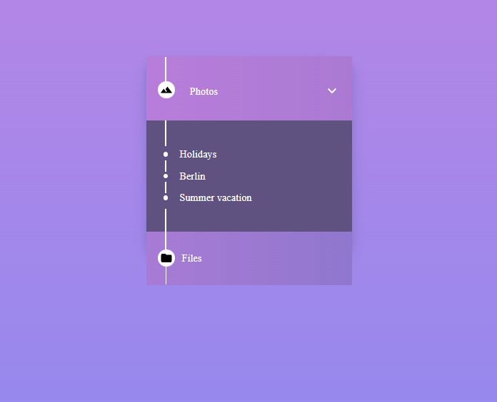

# loop2stepd
*An implementation of loop2step3 clone with html and css*
## Prequisite
- Your browser version should be up to date for better experience
## Getting Started
Clone or download this repository and run with a local server of open `index.html` with your favorite browser
## Features
- Home page
## Tech/framework used
- Html
- Css
## Demo
[Go live](https://rawcdn.githack.com/Ahmad-mustapha/loop2step2/3773597c8f0b9b337abadd8ab3f2f7fba80c6a8e/index.html)

## Contact
If you want to contact me you can reach me at
- ahmadishola12@gmail.com
## Addtional Info
- This is one of the series of project for the @CodeVillage.org 
- This is not meant for production. It's for learning purpose only